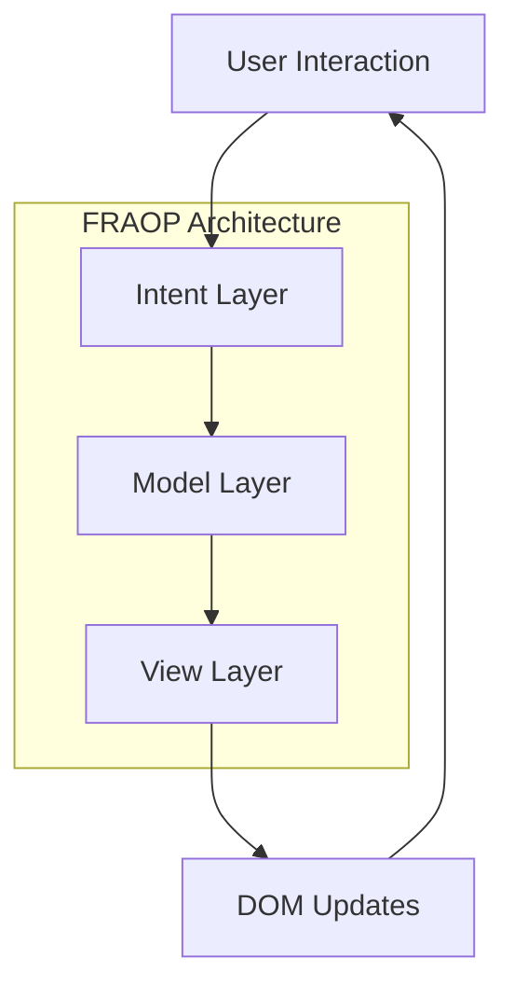
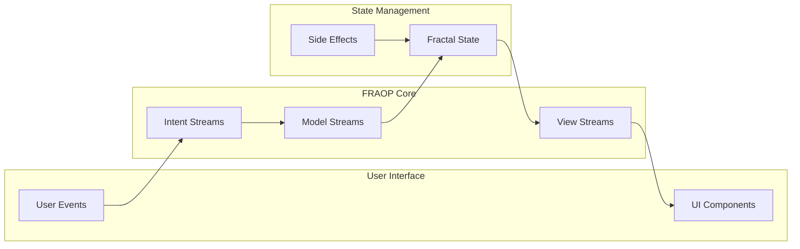
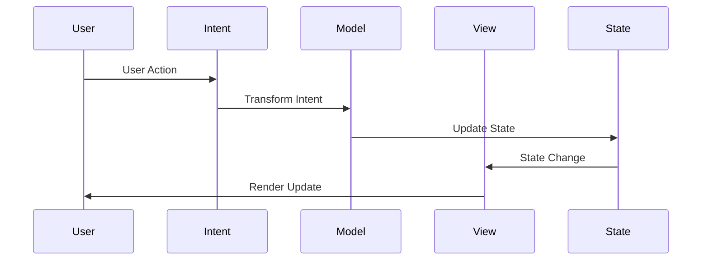
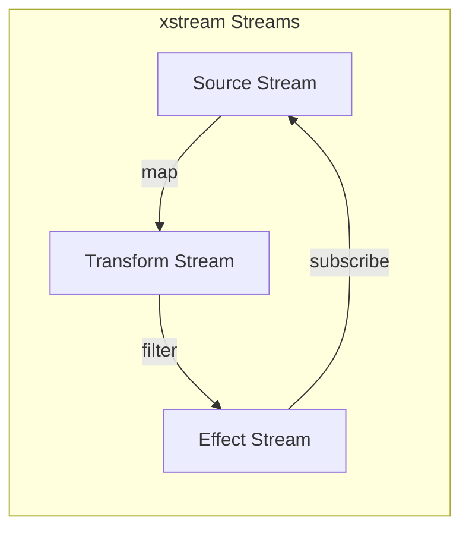
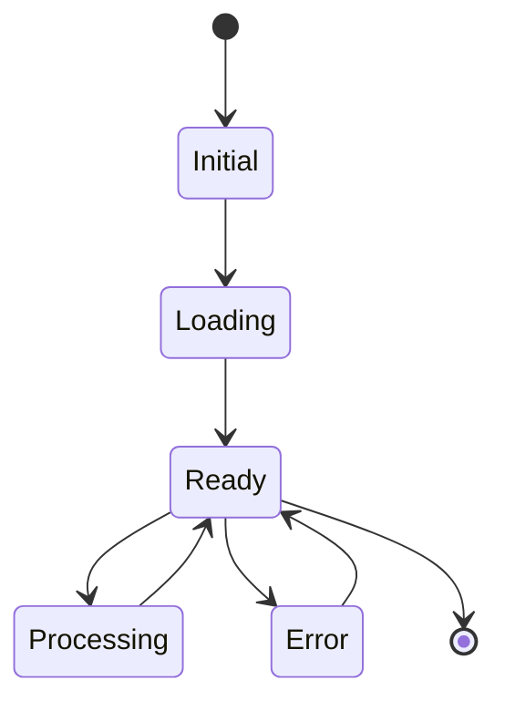
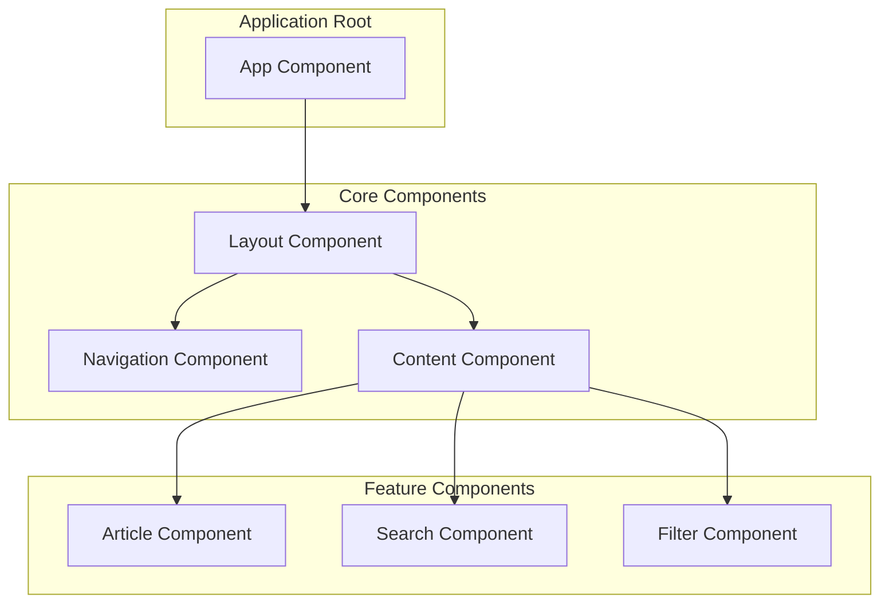
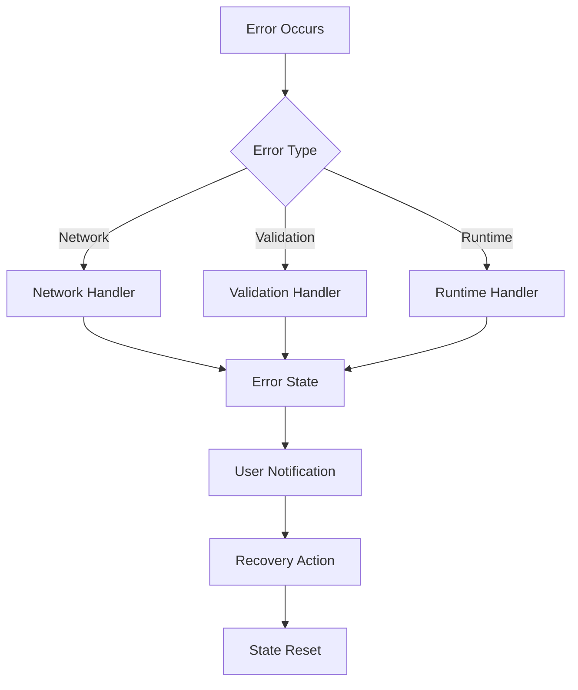
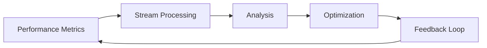

# SpinbitZ Application Flow

## Overview
This document outlines the application flow for the SpinbitZ website rebuild, focusing on the FRAOP (Functional-Reactive Aspect-Oriented Programming) architecture and MVI (Model-View-Intent) pattern implementation.

## Core Architecture Flow

## Data Flow Diagram

## Component Interaction

## Stream Processing

## Application States

## Component Hierarchy

## Error Handling Flow

## Performance Monitoring Flow

## Implementation Guidelines

1. **Stream Management**
   - Use xstream for all stream operations
   - Implement proper stream cleanup
   - Handle stream errors appropriately

2. **State Updates**
   - Follow unidirectional data flow
   - Implement proper state isolation
   - Use fractal state patterns

3. **Component Communication**
   - Use stream-based communication
   - Implement proper event handling
   - Follow MVI pattern strictly

4. **Error Handling**
   - Implement comprehensive error boundaries
   - Use stream error handling
   - Provide user feedback

5. **Performance Considerations**
   - Monitor stream performance
   - Implement proper memoization
   - Use efficient update patterns

## Testing Strategy

1. **Stream Testing**
   - Test stream transformations
   - Verify stream combinations
   - Check error handling

2. **Component Testing**
   - Test component rendering
   - Verify state updates
   - Check user interactions

3. **Integration Testing**
   - Test component communication
   - Verify data flow
   - Check error scenarios

## Monitoring and Debugging

1. **Stream Monitoring**
   - Log stream operations
   - Track stream performance
   - Monitor error rates

2. **State Monitoring**
   - Track state changes
   - Monitor state size
   - Check state consistency

3. **Performance Monitoring**
   - Track render times
   - Monitor memory usage
   - Check network requests 