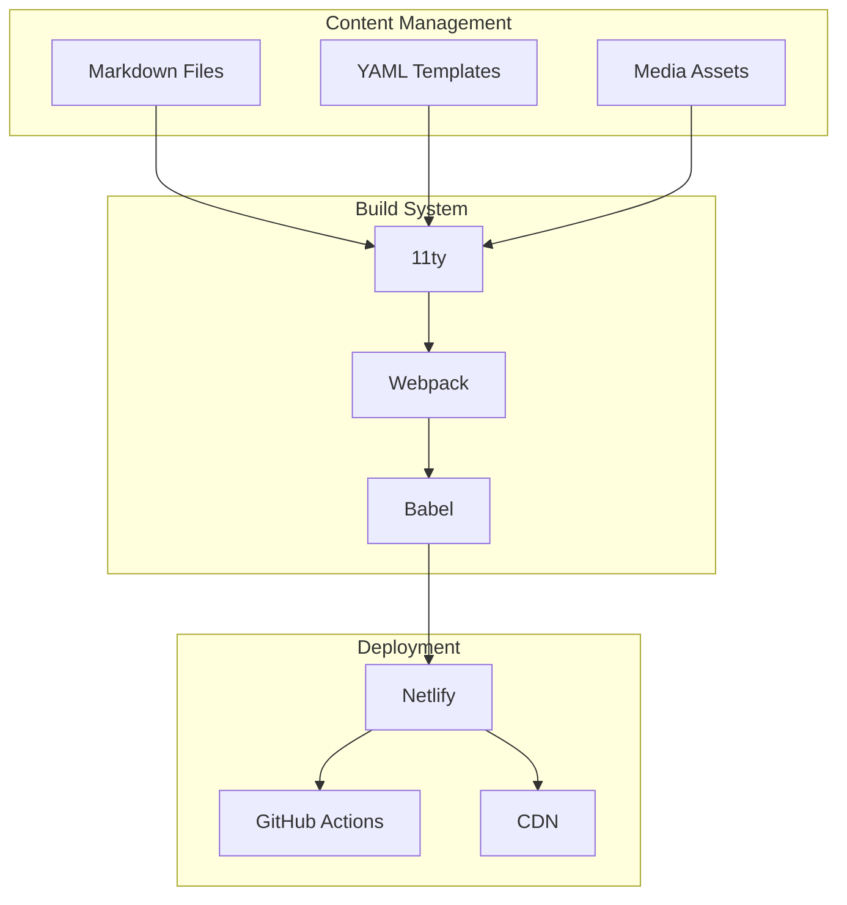
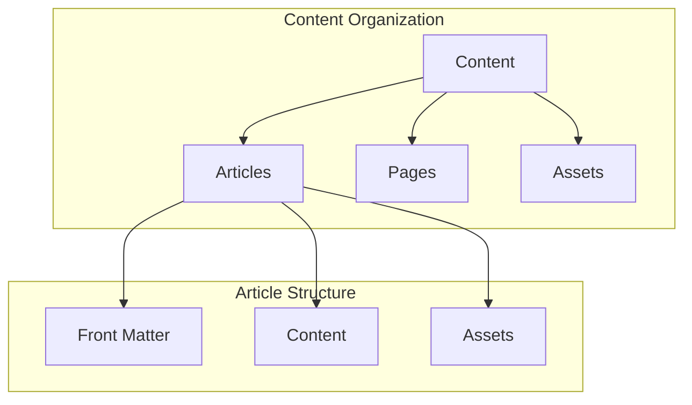
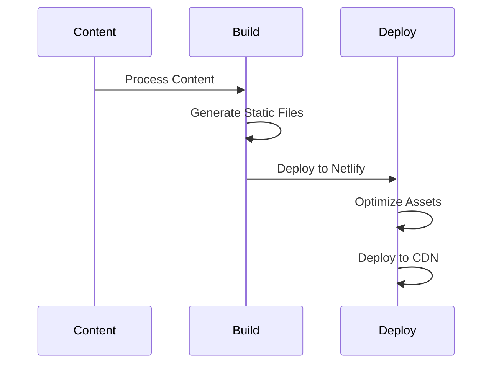
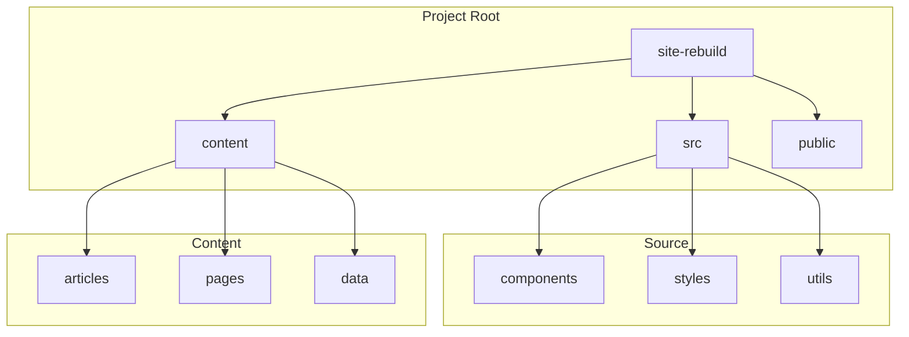
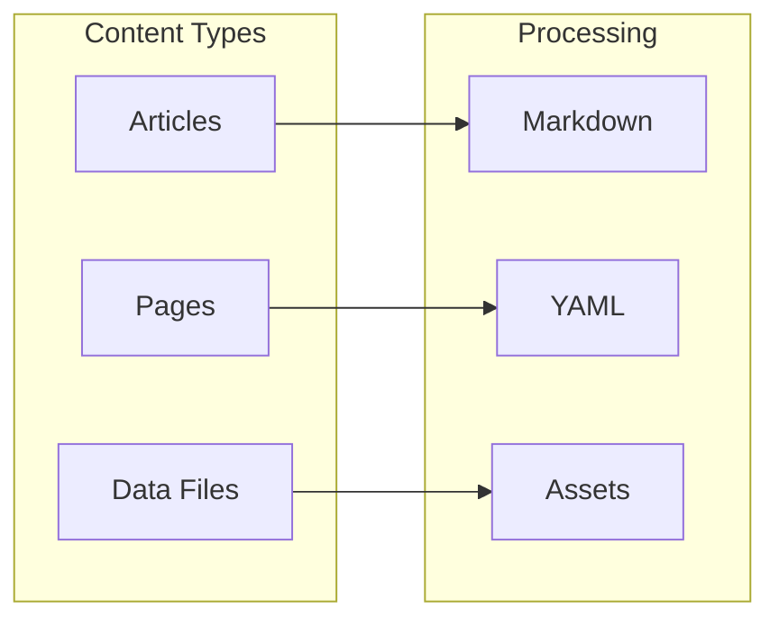
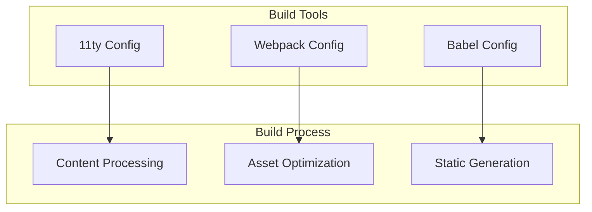
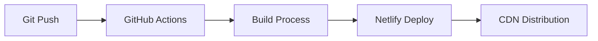

# Backend Structure

## Overview
This document outlines the backend structure for the SpinbitZ website rebuild, focusing on the static site generation (SSG) system and content management approach.

## Architecture Overview



## Content Structure



## Build Process



## File Structure



## Content Management



## Build Configuration



## Deployment Pipeline



## Content Templates

1. **Article Template**
   ```yaml
   ---
   title: Article Title
   date: YYYY-MM-DD
   author: Author Name
   tags: [tag1, tag2]
   ---
   
   Article content in markdown...
   ```

2. **Page Template**
   ```yaml
   ---
   title: Page Title
   layout: page
   permalink: /page-url/
   ---
   
   Page content in markdown...
   ```

## Build Configuration

1. **11ty Configuration**
   ```javascript
   module.exports = function(eleventyConfig) {
     // Configuration options
   };
   ```

2. **Webpack Configuration**
   ```javascript
   module.exports = {
     // Webpack configuration
   };
   ```

## Deployment Configuration

1. **Netlify Configuration**
   ```toml
   [build]
     command = "npm run build"
     publish = "dist"
   ```

2. **GitHub Actions Configuration**
   ```yaml
   name: Deploy
   on:
     push:
       branches: [main]
   ```

## Content Guidelines

1. **Article Structure**
   - Use proper front matter
   - Follow markdown guidelines
   - Optimize images

2. **Page Structure**
   - Use proper templates
   - Follow layout guidelines
   - Implement proper metadata

## Build Guidelines

1. **Content Processing**
   - Validate content
   - Process markdown
   - Optimize assets

2. **Asset Optimization**
   - Compress images
   - Minify CSS/JS
   - Optimize fonts

## Deployment Guidelines

1. **Pre-deployment Checks**
   - Validate content
   - Check build output
   - Verify assets

2. **Post-deployment Checks**
   - Verify deployment
   - Check CDN distribution
   - Monitor performance

## Monitoring and Analytics

1. **Build Monitoring**
   - Track build times
   - Monitor asset sizes
   - Check build errors

2. **Deployment Monitoring**
   - Track deployment times
   - Monitor CDN performance
   - Check error rates

## Security Measures

1. **Content Security**
   - Validate content
   - Sanitize input
   - Implement CSP

2. **Deployment Security**
   - Secure build process
   - Protect deployment keys
   - Implement proper access control

## Backup Strategy

1. **Content Backup**
   - Regular content backups
   - Version control
   - Asset backup

2. **Configuration Backup**
   - Backup build configs
   - Backup deployment configs
   - Backup environment variables

## Maintenance Plan

1. **Regular Updates**
   - Update dependencies
   - Update content
   - Update configurations

2. **Performance Optimization**
   - Optimize build process
   - Optimize deployment
   - Optimize content delivery 