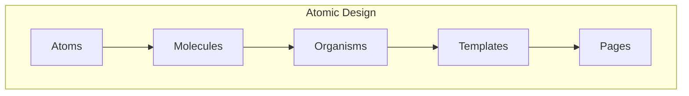
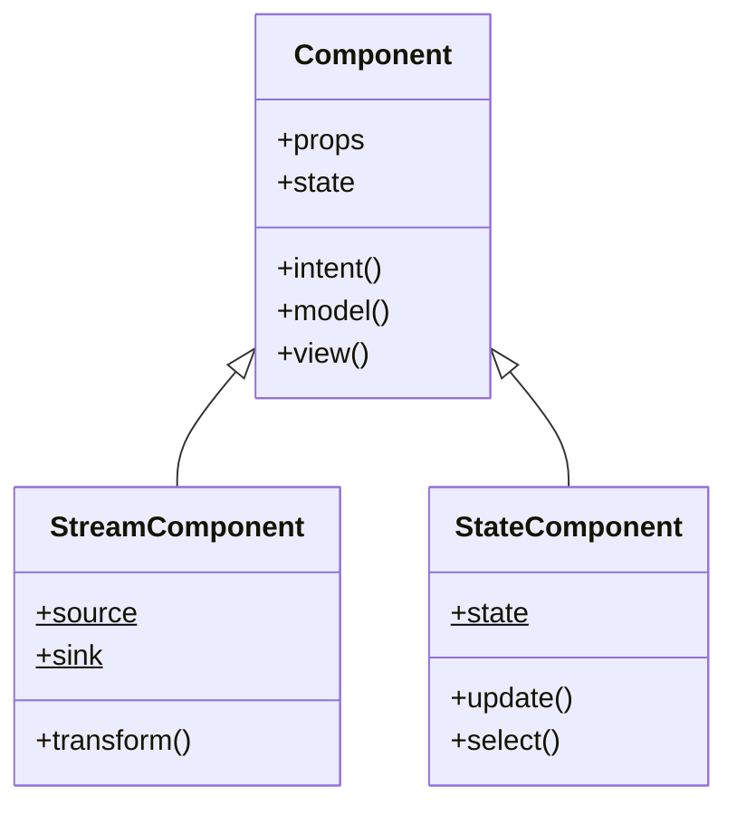
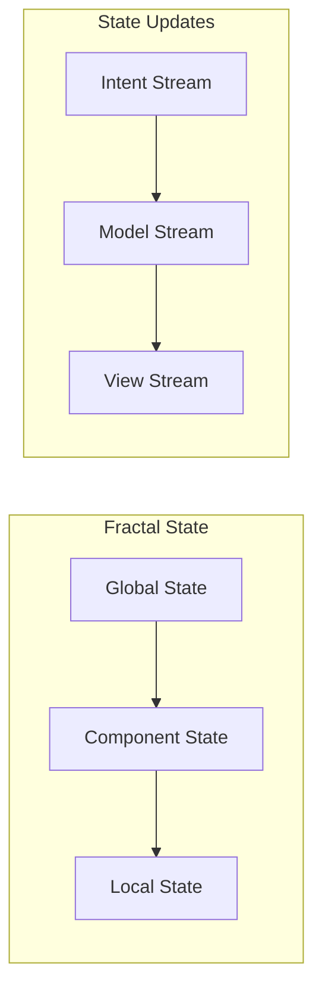
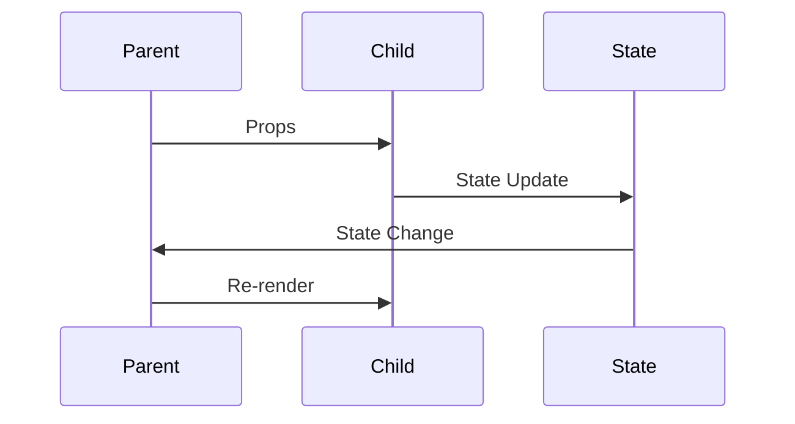
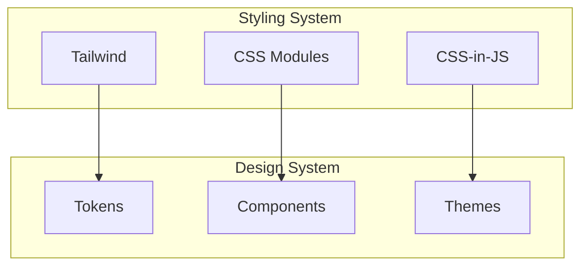
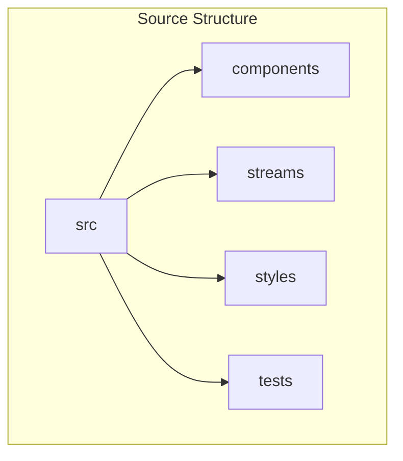
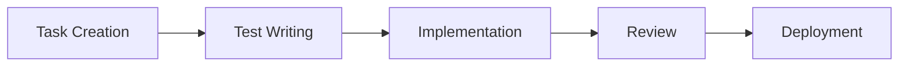

# Frontend Development Guidelines

## Overview
This document outlines the frontend development guidelines for the SpinbitZ website rebuild, focusing on FRAOP architecture, component design, and best practices.

## Component Architecture



## Component Structure



## State Management



## Component Communication



## Styling Architecture



## Code Organization



## Development Workflow



## Component Guidelines

1. **Component Structure**
   ```typescript
   interface ComponentProps {
     // Props interface
   }
   
   const Component: React.FC<ComponentProps> = (props) => {
     // Component implementation
   };
   ```

2. **Stream Implementation**
   ```typescript
   const componentStream = (sources: Sources) => {
     const intent$ = intent(sources);
     const model$ = model(intent$);
     const view$ = view(model$);
     
     return {
       DOM: view$
     };
   };
   ```

3. **State Management**
   ```typescript
   const state$ = stream.combine(
     intent$,
     model$,
     (intent, model) => ({
       ...intent,
       ...model
     })
   );
   ```

## Styling Guidelines

1. **Component Styling**
   ```typescript
   const styles = {
     container: 'flex flex-col p-4',
     header: 'text-2xl font-bold',
     content: 'mt-4'
   };
   ```

2. **Theme Implementation**
   ```typescript
   const theme = {
     colors: {
       primary: '#007bff',
       secondary: '#6c757d'
     },
     spacing: {
       sm: '0.5rem',
       md: '1rem',
       lg: '2rem'
     }
   };
   ```

## Testing Guidelines

1. **Component Testing**
   ```typescript
   describe('Component', () => {
     it('should render correctly', () => {
       // Test implementation
     });
     
     it('should handle state updates', () => {
       // Test implementation
     });
   });
   ```

2. **Stream Testing**
   ```typescript
   describe('Stream', () => {
     it('should transform data correctly', () => {
       // Test implementation
     });
     
     it('should handle errors', () => {
       // Test implementation
     });
   });
   ```

## Performance Guidelines

1. **Component Optimization**
   - Use React.memo for pure components
   - Implement proper memoization
   - Use efficient update patterns

2. **Stream Optimization**
   - Implement proper stream cleanup
   - Use efficient stream operators
   - Handle backpressure

3. **Bundle Optimization**
   - Implement code splitting
   - Use dynamic imports
   - Optimize asset loading

## Accessibility Guidelines

1. **ARIA Implementation**
   - Use proper ARIA roles
   - Implement proper labels
   - Handle keyboard navigation

2. **Semantic HTML**
   - Use proper HTML elements
   - Implement proper heading structure
   - Use proper form elements

## Error Handling

1. **Component Errors**
   - Implement error boundaries
   - Handle runtime errors
   - Provide user feedback

2. **Stream Errors**
   - Handle stream errors
   - Implement proper recovery
   - Log error information

## Documentation Guidelines

1. **Component Documentation**
   - Document props
   - Document state
   - Document methods

2. **Stream Documentation**
   - Document stream operators
   - Document transformations
   - Document error handling

## Review Checklist

1. **Code Quality**
   - Follow TypeScript guidelines
   - Implement proper testing
   - Follow style guide

2. **Performance**
   - Check bundle size
   - Verify performance metrics
   - Check accessibility

3. **Documentation**
   - Verify documentation
   - Check examples
   - Verify API documentation 