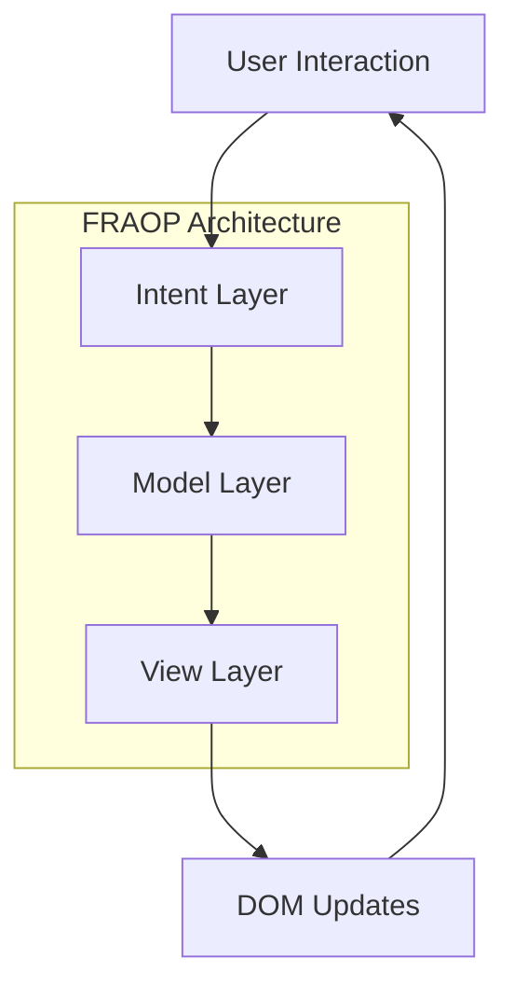
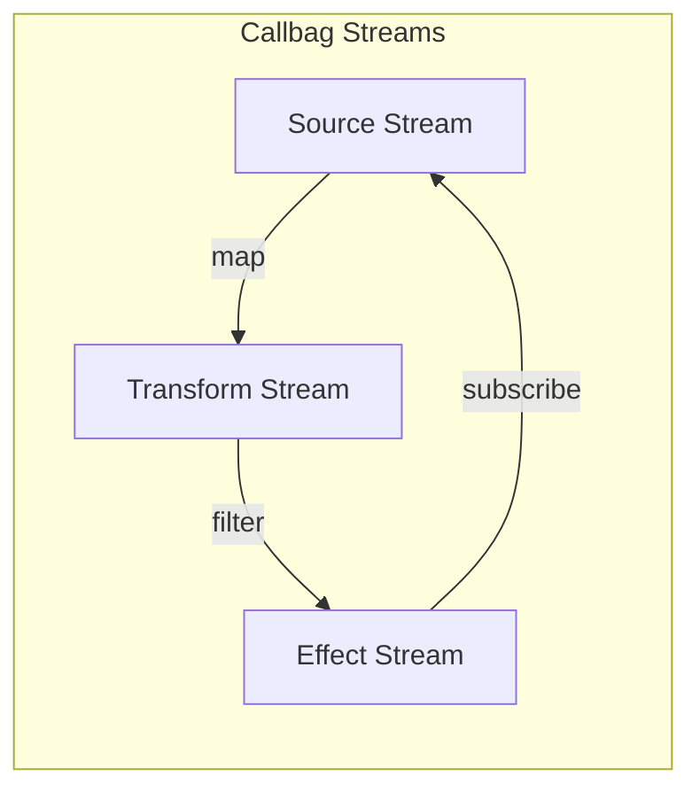
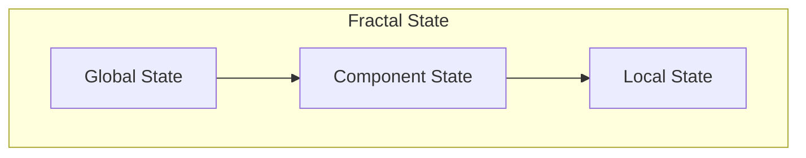

# Core Architecture

## Overview
The SpinbitZ website rebuild implements a Functional-Reactive Aspect-Oriented Programming (FRAOP) architecture, combining functional programming, reactive streams, and aspect-oriented programming principles.

## Architecture Components

### 1. FRAOP Core


### 2. Stream Management


### 3. State Management


## Key Principles

### 1. Functional Programming
- Pure functions
- Immutable data
- Function composition
- Higher-order functions

### 2. Reactive Programming
- Stream-based data flow
- Event-driven architecture
- Backpressure handling
- Stream composition

### 3. Aspect-Oriented Programming
- Cross-cutting concerns
- Aspect composition
- Dependency injection
- Modular architecture

## Implementation Details

### 1. Component Structure
```typescript
interface ComponentProps {
  // Component props
}

const Component: React.FC<ComponentProps> = (props) => {
  // Component implementation
};
```

### 2. Stream Implementation
```typescript
const componentStream = (sources: Sources) => {
  const intent$ = intent(sources);
  const model$ = model(intent$);
  const view$ = view(model$);
  
  return {
    DOM: view$
  };
};
```

### 3. State Management
```typescript
const state$ = stream.combine(
  intent$,
  model$,
  (intent, model) => ({
    ...intent,
    ...model
  })
);
```

## Architecture Guidelines

### 1. Component Design
- Follow atomic design principles
- Implement proper stream cleanup
- Use proper state isolation
- Follow accessibility guidelines

### 2. Stream Management
- Use callbags for streams
- Implement proper backpressure
- Handle stream errors
- Clean up streams properly

### 3. State Management
- Follow fractal state patterns
- Implement proper state isolation
- Use proper state updates
- Handle state persistence

## Testing Strategy

### 1. Unit Testing
- Test components
- Test streams
- Test state
- Test utilities

### 2. Integration Testing
- Test component interaction
- Test stream interaction
- Test state interaction
- Test error handling

### 3. Performance Testing
- Test stream performance
- Test state performance
- Test component performance
- Test overall performance

## Documentation Requirements

### 1. Component Documentation
- Document props
- Document state
- Document streams
- Document methods

### 2. Architecture Documentation
- Document patterns
- Document decisions
- Document trade-offs
- Document guidelines

## Related Documents
- [FRAOP Implementation](./fraop-implementation.md)
- [MVI Pattern](./mvi-pattern.md)
- [State Management](./state-management.md)
- [Technical Stack](../../tech-stack.md) 