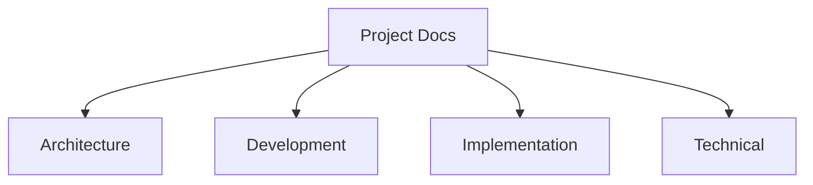
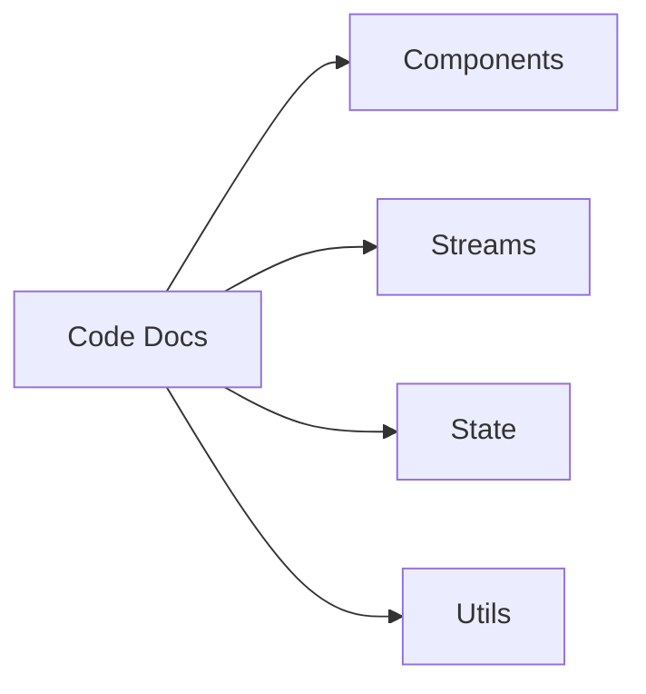
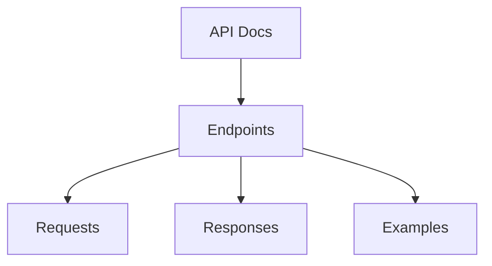

# Documentation Standards

## Overview
The documentation standards define the requirements and guidelines for maintaining comprehensive and consistent documentation throughout the SpinbitZ website rebuild project.

## Documentation Structure

### 1. Project Documentation


### 2. Code Documentation


### 3. API Documentation


## Documentation Types

### 1. Project Documentation
- Architecture overview
- Development guidelines
- Implementation plans
- Technical specifications
- API documentation

### 2. Code Documentation
- Component documentation
- Stream documentation
- State documentation
- Utility documentation
- Test documentation

### 3. User Documentation
- User guides
- API guides
- Integration guides
- Troubleshooting guides
- FAQ

## Documentation Format

### 1. Markdown Format
```markdown
# Title

## Overview
Brief description...

## Details
Detailed information...

## Examples
```typescript
// Code example
const example = () => {
  // Implementation
};
```

## Related
- [Link 1](./link1.md)
- [Link 2](./link2.md)
```

### 2. Code Comments
```typescript
/**
 * Component description
 * @param {Props} props - Component props
 * @returns {JSX.Element} Rendered component
 */
const Component = (props: Props): JSX.Element => {
  // Implementation
};
```

### 3. API Documentation
```typescript
/**
 * @api {get} /api/users Get Users
 * @apiName GetUsers
 * @apiGroup Users
 * @apiVersion 1.0.0
 *
 * @apiSuccess {Object[]} users List of users
 * @apiSuccess {Number} users.id User ID
 * @apiSuccess {String} users.name User name
 *
 * @apiExample {curl} Example usage:
 *     curl -i http://localhost:3000/api/users
 */
```

## Documentation Guidelines

### 1. Content Guidelines
- Be clear and concise
- Use proper formatting
- Include examples
- Add diagrams
- Link related docs

### 2. Code Guidelines
- Document interfaces
- Document functions
- Document components
- Document streams
- Document state

### 3. API Guidelines
- Document endpoints
- Document parameters
- Document responses
- Document errors
- Document examples

## Documentation Tools

### 1. Markdown
- Headers
- Lists
- Code blocks
- Tables
- Links

### 2. Diagrams
- Mermaid
- PlantUML
- Flowcharts
- Sequence diagrams
- State diagrams

### 3. Code Documentation
- JSDoc
- TypeDoc
- ESLint
- Prettier
- Markdown lint

## Documentation Process

### 1. Documentation Creation
1. Identify need
2. Gather information
3. Write documentation
4. Add examples
5. Review content

### 2. Documentation Review
1. Check accuracy
2. Check completeness
3. Check formatting
4. Check links
5. Check examples

### 3. Documentation Maintenance
1. Update regularly
2. Track changes
3. Version control
4. Review periodically
5. Archive old docs

## Documentation Examples

### 1. Component Documentation
```markdown
# Button Component

## Overview
A reusable button component that supports various styles and states.

## Props
| Prop | Type | Required | Default | Description |
|------|------|----------|---------|-------------|
| variant | string | No | 'primary' | Button style variant |
| size | string | No | 'medium' | Button size |
| disabled | boolean | No | false | Disabled state |

## Examples
```typescript
<Button variant="primary" size="large">
  Click me
</Button>
```

## Related
- [ButtonGroup](./ButtonGroup.md)
- [IconButton](./IconButton.md)
```

### 2. Stream Documentation
```markdown
# User Stream

## Overview
A stream that manages user data and authentication state.

## Operators
| Operator | Description |
|----------|-------------|
| map | Transform user data |
| filter | Filter user events |
| merge | Combine user streams |

## Examples
```typescript
const userStream = createUserStream();
userStream
  .pipe(
    map(user => user.name),
    filter(name => name.length > 0)
  )
  .subscribe(console.log);
```

## Related
- [Auth Stream](./AuthStream.md)
- [Profile Stream](./ProfileStream.md)
```

### 3. State Documentation
```markdown
# User State

## Overview
State management for user data and authentication.

## Actions
| Action | Payload | Description |
|--------|---------|-------------|
| SET_USER | User | Set user data |
| CLEAR_USER | null | Clear user data |
| UPDATE_USER | Partial<User> | Update user data |

## Examples
```typescript
dispatch({
  type: 'SET_USER',
  payload: {
    id: 1,
    name: 'Test User'
  }
});
```

## Related
- [Auth State](./AuthState.md)
- [Profile State](./ProfileState.md)
```

## Related Documents
- [TTDD System](./ttdd-system.md)
- [Task Management](./task-management.md)
- [Testing Strategy](./testing-strategy.md)
- [Implementation Plan](../../implementation-plan.md)

## Git Workflow
- All Git operations (commits, pushes, etc.) must be performed in the parent directory (`SpinbitZ`), not in `site-rebuild`.
- Ensure you are in the correct directory before running Git commands. 

## FRAOP Architecture and App Skeleton

### Folder Structure
- `src/components/`: Reusable UI components
- `src/streams/`: Stream management using xstream
- `src/state/`: State management using FRAOP
- `src/fraop/`: Core FRAOP architecture files
  - `index.ts`: Entry point for FRAOP initialization
  - `aspects.ts`: Aspect definitions for FRAOP
- `src/pages/`: Page components (e.g., Home, NotFound)
- `src/index.tsx`: Main app entry point

### Key Files
- `src/index.tsx`: Renders the App component and handles routing
- `src/pages/Home.tsx`: Home page component
- `src/pages/NotFound.tsx`: 404 Not Found page component
- `src/fraop/index.ts`: FRAOP initialization
- `src/fraop/aspects.ts`: FRAOP aspect definitions

### Testing
- Tests are located in `src/__tests__/`
- Use Vitest and React Testing Library for component and routing tests 