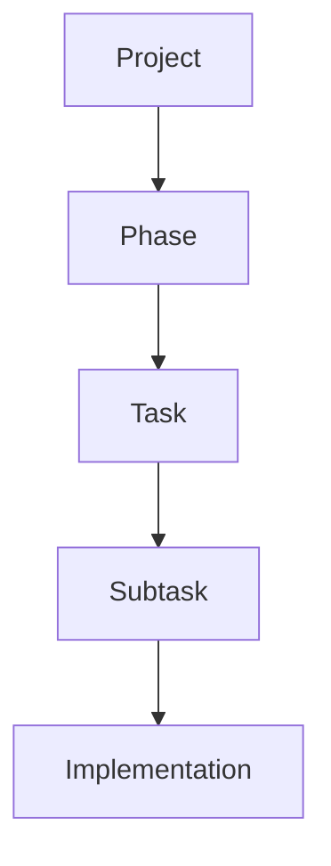
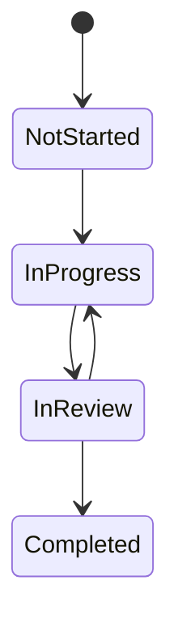
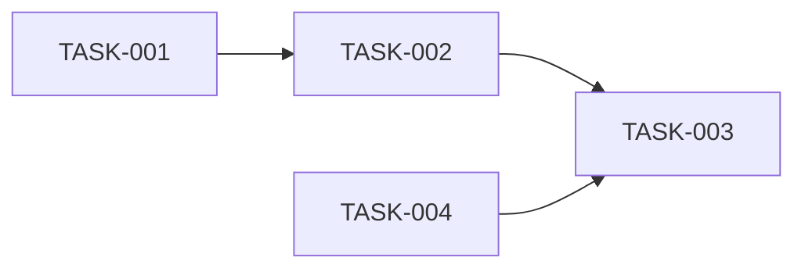

# Task Management System

## Overview
The task management system provides a structured approach to tracking and managing development tasks throughout the SpinbitZ website rebuild project.

## Task Organization

### 1. Task Hierarchy


### 2. Task States


### 3. Task Dependencies


## Task Tracking

### 1. Task Status
- Not Started
- In Progress
- In Review
- Completed

### 2. Task Priority
- High
- Medium
- Low

### 3. Task Estimates
- Story Points (1-13)
- Time Estimates
- Complexity Rating

## Task Workflow

### 1. Task Creation
1. Identify requirement
2. Create task template
3. Define acceptance criteria
4. Write initial tests
5. Set dependencies

### 2. Task Implementation
1. Write failing tests
2. Implement feature
3. Pass tests
4. Document changes
5. Update status

### 3. Task Review
1. Code review
2. Test review
3. Documentation review
4. Performance check
5. Approval

## Task Documentation

### 1. Task Template
```markdown
# TASK-XXX: Task Title

## Status
- [ ] Not Started
- [ ] In Progress
- [ ] In Review
- [ ] Completed

## Priority
- [ ] High
- [ ] Medium
- [ ] Low

## Estimate
- Story Points: X

## Dependencies
- TASK-YYY
- TASK-ZZZ

## Description
Detailed task description...

## Acceptance Criteria
- [ ] Criterion 1
- [ ] Criterion 2
- [ ] Criterion 3

## Test Cases
```typescript
describe('Feature', () => {
  it('should do something', () => {
    // Test implementation
  });
});
```

## Implementation Notes
- Note 1
- Note 2
- Note 3

## Review Checklist
- [ ] Tests written
- [ ] Code reviewed
- [ ] Documentation updated
- [ ] Performance checked

## Git Commit Message
feat(scope): Implement feature

- Detail 1
- Detail 2
- Detail 3
```

## Task Management Guidelines

### 1. Task Creation
- Use template
- Be specific
- Define criteria
- Set dependencies
- Estimate effort

### 2. Task Implementation
- Follow TTDD
- Write tests first
- Document changes
- Update status
- Track progress

### 3. Task Review
- Check quality
- Verify tests
- Review docs
- Check performance
- Approve changes

## Task Tracking Tools

### 1. Version Control
- Git branches
- Commit messages
- Pull requests
- Code review

### 2. Documentation
- Markdown files
- Task templates
- Status updates
- Progress tracking

### 3. Communication
- Team updates
- Status reports
- Blockers
- Dependencies

## Related Documents
- [TTDD System](./ttdd-system.md)
- [Testing Strategy](./testing-strategy.md)
- [Documentation Standards](./documentation-standards.md)
- [Implementation Plan](../../implementation-plan.md) 