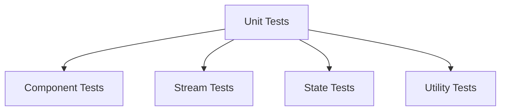
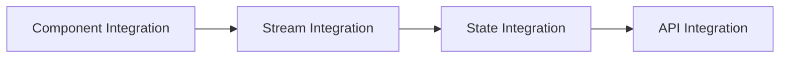
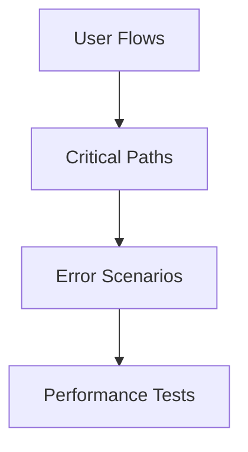

# Testing Strategy

## Overview
The testing strategy implements a comprehensive approach to ensuring code quality and reliability through multiple layers of testing, following the Test and Task Driven Development (TTDD) methodology.

## Testing Layers

### 1. Unit Testing


### 2. Integration Testing


### 3. E2E Testing


## Testing Framework

### 1. Jest Configuration
```javascript
module.exports = {
  preset: 'ts-jest',
  testEnvironment: 'jsdom',
  setupFilesAfterEnv: ['<rootDir>/src/setupTests.ts'],
  moduleNameMapper: {
    '\\.(css|less|scss|sass)$': 'identity-obj-proxy',
    '\\.(gif|ttf|eot|svg)$': '<rootDir>/__mocks__/fileMock.js'
  },
  collectCoverageFrom: [
    'src/**/*.{ts,tsx}',
    '!src/**/*.d.ts',
    '!src/index.tsx',
    '!src/serviceWorker.ts'
  ],
  coverageThreshold: {
    global: {
      branches: 90,
      functions: 90,
      lines: 90,
      statements: 90
    }
  }
};
```

### 2. Testing Utilities
```typescript
// Test utilities for components
export const renderWithProviders = (
  ui: React.ReactElement,
  {
    initialState = {},
    store = configureStore({
      reducer: rootReducer,
      preloadedState: initialState
    })
  } = {}
) => {
  return {
    ...render(
      <Provider store={store}>
        {ui}
      </Provider>
    ),
    store
  };
};

// Test utilities for streams
export const createTestStream = <T>(initialValue: T) => {
  const stream = new Subject<T>();
  stream.next(initialValue);
  return stream;
};

// Test utilities for state
export const createTestState = <T>(initialState: T) => {
  return {
    ...initialState,
    dispatch: jest.fn()
  };
};
```

## Testing Guidelines

### 1. Component Testing
- Test component rendering
- Test component interactions
- Test component state
- Test component effects
- Test component props

### 2. Stream Testing
- Test stream creation
- Test stream operators
- Test stream composition
- Test stream error handling
- Test stream completion

### 3. State Testing
- Test state initialization
- Test state updates
- Test state selectors
- Test state effects
- Test state middleware

## Test Implementation

### 1. Component Test Example
```typescript
describe('Button Component', () => {
  it('renders correctly', () => {
    const { getByText } = render(<Button>Click me</Button>);
    expect(getByText('Click me')).toBeInTheDocument();
  });

  it('handles click events', () => {
    const handleClick = jest.fn();
    const { getByText } = render(
      <Button onClick={handleClick}>Click me</Button>
    );
    fireEvent.click(getByText('Click me'));
    expect(handleClick).toHaveBeenCalled();
  });
});
```

### 2. Stream Test Example
```typescript
describe('User Stream', () => {
  it('emits user data', () => {
    const userStream = createTestStream<User>({
      id: 1,
      name: 'Test User'
    });
    
    const subscription = userStream.subscribe(user => {
      expect(user).toEqual({
        id: 1,
        name: 'Test User'
      });
    });
    
    subscription.unsubscribe();
  });
});
```

### 3. State Test Example
```typescript
describe('User State', () => {
  it('updates user data', () => {
    const initialState = {
      user: null,
      loading: false,
      error: null
    };
    
    const state = createTestState(initialState);
    const action = {
      type: 'SET_USER',
      payload: {
        id: 1,
        name: 'Test User'
      }
    };
    
    const newState = userReducer(state, action);
    expect(newState.user).toEqual(action.payload);
  });
});
```

## Performance Testing

### 1. Component Performance
- Render time
- Re-render frequency
- Memory usage
- CPU usage
- Network requests

### 2. Stream Performance
- Stream throughput
- Stream latency
- Memory usage
- CPU usage
- Network usage

### 3. State Performance
- State update time
- State select time
- Memory usage
- CPU usage
- Network usage

## Testing Tools

### 1. Jest
- Test runner
- Assertions
- Mocks
- Coverage
- Snapshots

### 2. React Testing Library
- Component testing
- User interactions
- Accessibility
- DOM queries
- Event handling

### 3. Cypress
- E2E testing
- User flows
- Network mocking
- Visual testing
- Performance testing

## Related Documents
- [TTDD System](./ttdd-system.md)
- [Task Management](./task-management.md)
- [Documentation Standards](./documentation-standards.md)
- [Implementation Plan](../../implementation-plan.md) 