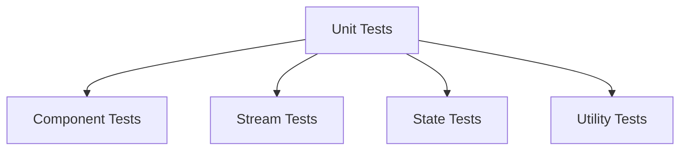
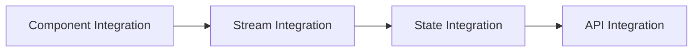
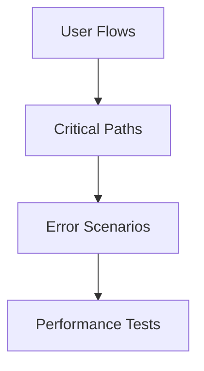

# Testing Strategy

## Overview
The testing strategy implements a comprehensive approach to ensuring code quality and reliability through multiple layers of testing, following the Test and Task Driven Development (TTDD) methodology.

## Testing Layers

### 1. Unit Testing


### 2. Integration Testing


### 3. E2E Testing


## Testing Framework

### 1. Vitest Configuration
```js
// vitest.config.js
import { defineConfig } from 'vitest/config';

export default defineConfig({
  test: {
    environment: 'jsdom',
    globals: true,
    setupFiles: ['./src/__tests__/setup.ts'],
    coverage: {
      reporter: ['text', 'json', 'html'],
      exclude: ['node_modules/', 'src/__tests__/'],
    },
  },
});
```

### 2. Testing Utilities

- **Vitest**: The primary testing framework.
- **React Testing Library**: For testing React components.
- **xstream**: For testing reactive streams in Cycle.js.

### Example: Testing a Cycle.js Component

```js
import { describe, it, expect } from 'vitest';
import { render, screen } from '@testing-library/react';
import { App } from '../../fraop';

describe('FRAOP App', () => {
  it('renders without crashing', () => {
    render(<App />);
  });

  it('displays the correct heading', () => {
    render(<App />);
    expect(screen.getByText('FRAOP Cycle.js App Shell - Count: 0')).toBeInTheDocument();
  });

  it('increments the counter on button click', () => {
    render(<App />);
    const button = screen.getByText('Increment');
    button.click();
    expect(screen.getByText('FRAOP Cycle.js App Shell - Count: 1')).toBeInTheDocument();
  });

  it('decrements the counter on button click', () => {
    render(<App />);
    const button = screen.getByText('Decrement');
    button.click();
    expect(screen.getByText('FRAOP Cycle.js App Shell - Count: -1')).toBeInTheDocument();
  });

  it('resets the counter on button click', () => {
    render(<App />);
    const inc = screen.getByText('Increment');
    inc.click();
    inc.click();
    const reset = screen.getByText('Reset');
    reset.click();
    expect(screen.getByText('FRAOP Cycle.js App Shell - Count: 0')).toBeInTheDocument();
  });
});
```

## Testing Guidelines

### 1. Component Testing
- Test component rendering
- Test component interactions
- Test component state
- Test component effects
- Test component props

### 2. Stream Testing
- Test stream creation
- Test stream operators
- Test stream composition
- Test stream error handling
- Test stream completion

### 3. State Testing
- Test state initialization
- Test state updates
- Test state selectors
- Test state effects
- Test state middleware

## Test Implementation

### 1. Component Test Example
```typescript
import { describe, it, expect } from 'vitest';
import { render, fireEvent } from '@testing-library/react';

describe('Button Component', () => {
  it('renders correctly', () => {
    const { getByText } = render(<Button>Click me</Button>);
    expect(getByText('Click me')).toBeInTheDocument();
  });

  it('handles click events', () => {
    const handleClick = vi.fn();
    const { getByText } = render(
      <Button onClick={handleClick}>Click me</Button>
    );
    fireEvent.click(getByText('Click me'));
    expect(handleClick).toHaveBeenCalled();
  });
});
```

### 2. Stream Test Example
```typescript
import { describe, it, expect } from 'vitest';

describe('User Stream', () => {
  it('emits user data', () => {
    const userStream = createTestStream<User>({
      id: 1,
      name: 'Test User'
    });
    
    const subscription = userStream.subscribe(user => {
      expect(user).toEqual({
        id: 1,
        name: 'Test User'
      });
    });
    
    subscription.unsubscribe();
  });
});
```

### 3. State Test Example
```typescript
import { describe, it, expect } from 'vitest';

describe('User State', () => {
  it('updates user data', () => {
    const initialState = {
      user: null,
      loading: false,
      error: null
    };
    
    const state = createTestState(initialState);
    const action = {
      type: 'SET_USER',
      payload: {
        id: 1,
        name: 'Test User'
      }
    };
    
    const newState = userReducer(state, action);
    expect(newState.user).toEqual(action.payload);
  });
});
```

## Performance Testing

### 1. Component Performance
- Render time
- Re-render frequency
- Memory usage
- CPU usage
- Network requests

### 2. Stream Performance
- Stream throughput
- Stream latency
- Memory usage
- CPU usage
- Network usage

### 3. State Performance
- State update time
- State select time
- Memory usage
- CPU usage
- Network usage

## Testing Tools

### 1. Vitest
- Test runner
- Assertions
- Mocks
- Coverage
- Snapshots

### 2. React Testing Library
- Component testing
- User interactions
- Accessibility
- DOM queries
- Event handling

### 3. Cypress
- E2E testing
- User flows
- Network mocking
- Visual testing
- Performance testing

## Related Documents
- [TTDD System](./ttdd-system.md)
- [Task Management](./task-management.md)
- [Documentation Standards](./documentation-standards.md)
- [Implementation Plan](../../implementation-plan.md) 