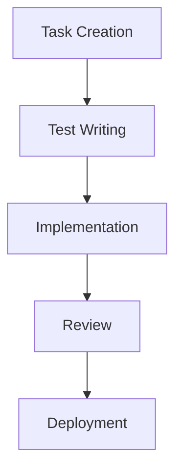
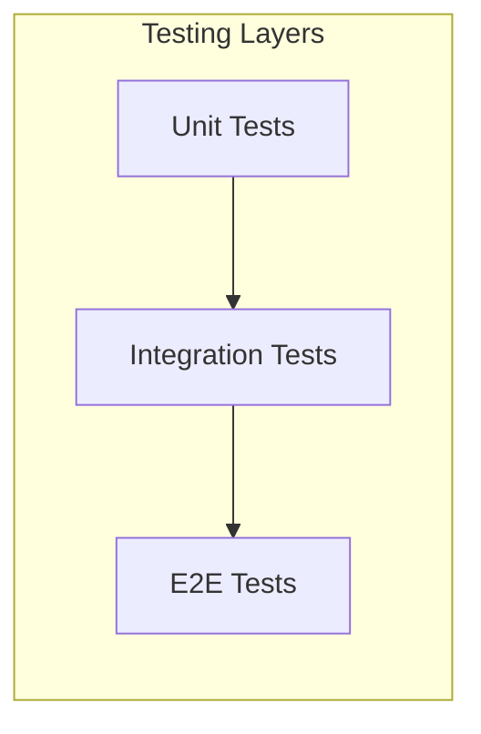
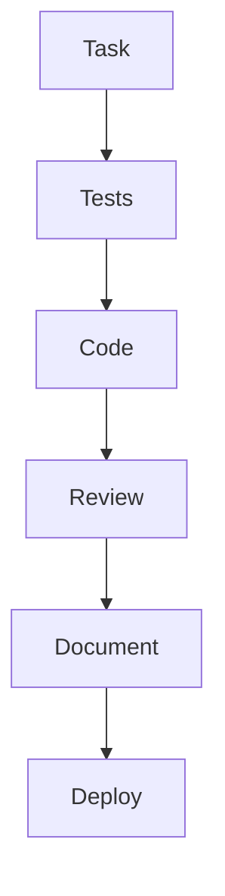

# Test and Task Driven Development (TTDD) System

## Overview
The TTDD system implements a rigorous development methodology that combines Test-Driven Development (TDD) with structured task management, ensuring high-quality, predictable, and maintainable code.

## System Components

### 1. Task Management


### 2. Testing Framework


### 3. Development Workflow


## Task Structure

### 1. Task Template
```markdown
# TASK-XXX: Task Title

## Status
- [ ] Not Started
- [ ] In Progress
- [ ] In Review
- [ ] Completed

## Priority
- [ ] High
- [ ] Medium
- [ ] Low

## Estimate
- Story Points: X

## Dependencies
- TASK-YYY
- TASK-ZZZ

## Description
Detailed task description...

## Acceptance Criteria
- [ ] Criterion 1
- [ ] Criterion 2
- [ ] Criterion 3

## Test Cases
```typescript
describe('Feature', () => {
  it('should do something', () => {
    // Test implementation
  });
});
```

## Implementation Notes
- Note 1
- Note 2
- Note 3

## Review Checklist
- [ ] Tests written
- [ ] Code reviewed
- [ ] Documentation updated
- [ ] Performance checked

## Git Commit Message
feat(scope): Implement feature

- Detail 1
- Detail 2
- Detail 3
```

## Testing Strategy

### 1. Unit Testing
- Component tests
- Stream tests
- State tests
- Utility tests

### 2. Integration Testing
- Component interaction
- Stream composition
- State flow
- API integration

### 3. E2E Testing
- User flows
- Critical paths
- Error scenarios
- Performance metrics

## Quality Gates

### 1. Code Quality
- ESLint passing
- TypeScript checking
- Complexity metrics
- Code coverage > 90%

### 2. Test Quality
- All tests passing
- Coverage requirements met
- Performance benchmarks met
- Accessibility standards met

### 3. Documentation Quality
- Documentation complete
- Examples provided
- API documented
- Changes documented

## Implementation Guidelines

### 1. Task Management
- Follow task template
- Write tests first
- Document changes
- Follow review process

### 2. Testing
- Write comprehensive tests
- Follow testing patterns
- Document test cases
- Maintain coverage

### 3. Documentation
- Document components
- Document streams
- Document state
- Document changes

## Review Process

### 1. Code Review
- Check FRAOP compliance
- Verify MVI implementation
- Check test coverage
- Verify documentation

### 2. Documentation Review
- Check completeness
- Check accuracy
- Check examples
- Check formatting

## Related Documents
- [Task Management](./task-management.md)
- [Testing Strategy](./testing-strategy.md)
- [Documentation Standards](./documentation-standards.md)
- [Implementation Plan](../../implementation-plan.md) 