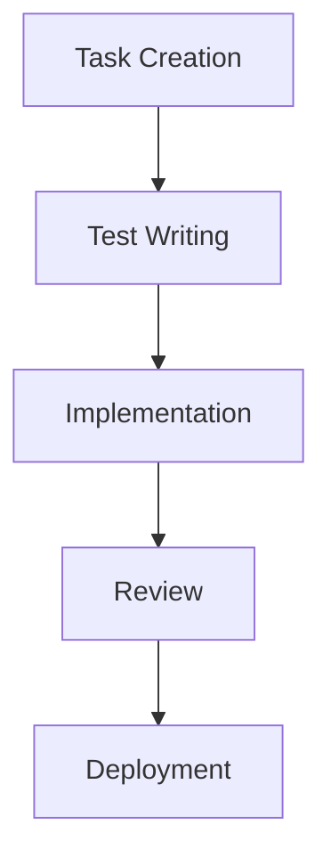
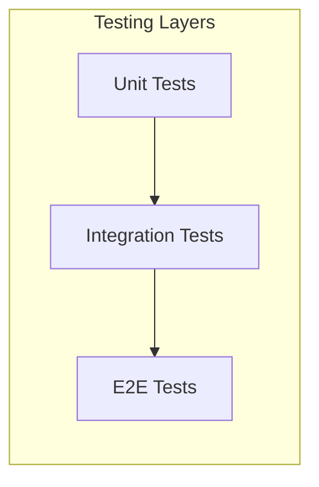
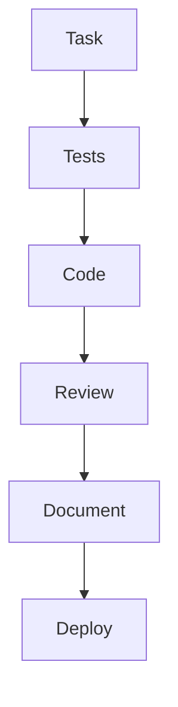

# Test and Task Driven Development (TTDD) System

## Overview
The TTDD system implements a rigorous development methodology that combines Test-Driven Development (TDD) with structured task management, ensuring high-quality, predictable, and maintainable code.

## System Components

### 1. Task Management


### 2. Testing Framework


### 3. Development Workflow


## Task Structure

### 1. Task Template
```markdown
# TASK-XXX: Task Title

## GitHub Issue
- Issue Number: #YYY
- Status: [open/closed]
- Labels: [list of labels]

## Status
- [ ] Not Started
- [ ] In Progress
- [ ] In Review
- [ ] Completed

## Priority
- [ ] High
- [ ] Medium
- [ ] Low

## Estimate
- Story Points: X

## Dependencies
- TASK-YYY
- TASK-ZZZ

## Description
Detailed task description...

## Acceptance Criteria
- [ ] Criterion 1
- [ ] Criterion 2
- [ ] Criterion 3

## Test Cases
```typescript
describe('Feature', () => {
  it('should do something', () => {
    // Test implementation
  });
});
```

## Implementation Notes
- Note 1
- Note 2
- Note 3

## Review Checklist
- [ ] Tests written
- [ ] Code reviewed
- [ ] Documentation updated
- [ ] Performance checked

## Git Commit Message
feat(scope): Implement feature

- Detail 1
- Detail 2
- Detail 3
```

## Testing Strategy

### 1. Unit Testing
- Component tests
- Stream tests
- State tests
- Utility tests

### 2. Integration Testing
- Component interaction
- Stream composition
- State flow
- API integration

### 3. E2E Testing
- User flows
- Critical paths
- Error scenarios
- Performance metrics

## Quality Gates

### 1. Code Quality
- ESLint passing
- TypeScript checking
- Complexity metrics
- Code coverage > 90%

### 2. Test Quality
- All tests passing
- Coverage requirements met
- Performance benchmarks met
- Accessibility standards met

### 3. Documentation Quality
- Documentation complete
- Examples provided
- API documented
- Changes documented

## Implementation Guidelines

### 1. Task Management
- Follow task template
- Write tests first
- Document changes
- Follow review process

### 2. Testing
- Write comprehensive tests
- Follow testing patterns
- Document test cases
- Maintain coverage

### 3. Documentation
- Document components
- Document streams
- Document state
- Document changes

## Review Process

### 1. Code Review
- Check FRAOP compliance
- Verify MVI implementation
- Check test coverage
- Verify documentation

### 2. Documentation Review
- Check completeness
- Check accuracy
- Check examples
- Check formatting

## Related Documents
- [Task Management](./task-management.md)
- [Testing Strategy](./testing-strategy.md)
- [Documentation Standards](./documentation-standards.md)
- [Implementation Plan](../../implementation-plan.md)

## TTDD Development Cycle

### 1. Task Definition
- Create detailed task documentation
- Create corresponding GitHub Issue
- Define acceptance criteria
- Specify test cases
- Document implementation requirements
- No commits at this stage

### 2. Test Implementation
- Write test cases based on acceptance criteria
- Implement test infrastructure
- Verify test coverage
- Update GitHub Issue with test progress
- No commits at this stage

### 3. Implementation
- Develop features based on test requirements
- Follow FRAOP architecture guidelines
- Implement all required functionality
- Update GitHub Issue with implementation progress
- No commits at this stage

### 4. Testing
- Run all test cases
- Verify acceptance criteria
- Document test results
- Update GitHub Issue with test results
- No commits at this stage

### 5. Review
- Code review against standards
- Verify implementation matches requirements
- Check test coverage
- Document review findings
- Update GitHub Issue with review status
- No commits at this stage

### 6. Task Completion
- All tests passing
- All acceptance criteria met
- Code reviewed and approved
- Documentation updated
- GitHub Issue marked as ready for closure
- **WAIT for explicit commit request from user**

### 7. Commit (ONLY after explicit user request)
- Create detailed commit message
- Include task reference
- Document changes
- Push changes to repository
- Close GitHub Issue with commit reference

## Quality Gates
1. Task Definition
   - [ ] Complete task documentation
   - [ ] GitHub Issue created
   - [ ] Defined acceptance criteria
   - [ ] Specified test cases
   - [ ] Documented implementation requirements

2. Test Implementation
   - [ ] All test cases written
   - [ ] Test infrastructure in place
   - [ ] Test coverage verified
   - [ ] GitHub Issue updated with test progress

3. Implementation
   - [ ] Features implemented
   - [ ] FRAOP guidelines followed
   - [ ] All functionality complete
   - [ ] GitHub Issue updated with implementation progress

4. Testing
   - [ ] All tests passing
   - [ ] Acceptance criteria met
   - [ ] Test results documented
   - [ ] GitHub Issue updated with test results

5. Review
   - [ ] Code review completed
   - [ ] Implementation verified
   - [ ] Test coverage confirmed
   - [ ] Review findings documented
   - [ ] GitHub Issue updated with review status

6. Task Completion
   - [ ] All quality gates passed
   - [ ] Documentation updated
   - [ ] GitHub Issue marked as ready for closure
   - [ ] Ready for commit

7. Commit (ONLY after explicit user request)
   - [ ] User has requested commit
   - [ ] Detailed commit message prepared
   - [ ] Task reference included
   - [ ] Changes documented
   - [ ] Changes pushed to repository
   - [ ] GitHub Issue closed with commit reference

## Implementation Guidelines

### Task Documentation
- Use standardized task template
- Include GitHub Issue reference
- Include all required sections
- Document dependencies
- Specify success criteria

### Test Implementation
- Write tests before implementation
- Cover all acceptance criteria
- Include edge cases
- Document test scenarios
- Update GitHub Issue with test progress

### Development Process
- Follow FRAOP architecture
- Implement incrementally
- Document changes
- Maintain test coverage
- Update GitHub Issue with progress

### Review Process
- Verify against standards
- Check implementation
- Review documentation
- Confirm test coverage
- Update GitHub Issue with review status

### Commit Process
- WAIT for explicit user request
- Create detailed commit message
- Include task reference
- Document all changes
- Push to repository
- Close GitHub Issue with commit reference

## Related Documents
- Task Management
- Testing Strategy
- Documentation Standards
- Implementation Plan
- GitHub Issues Integration Guide 