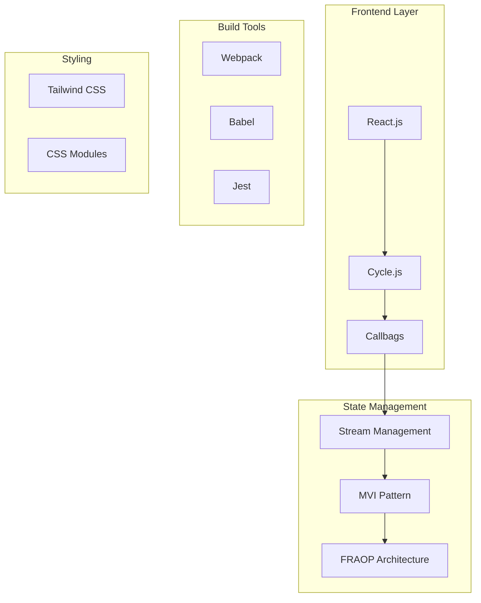
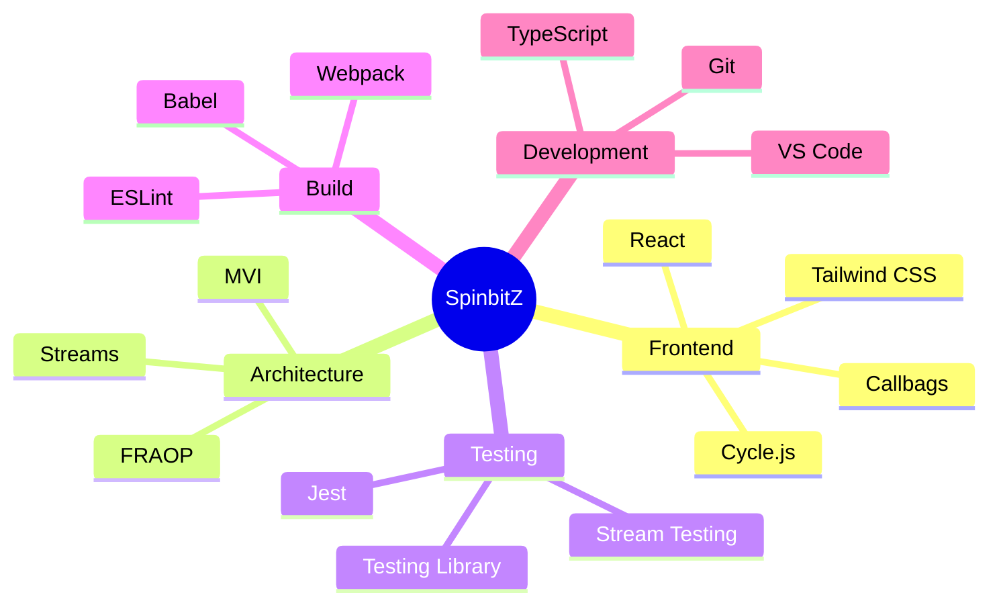
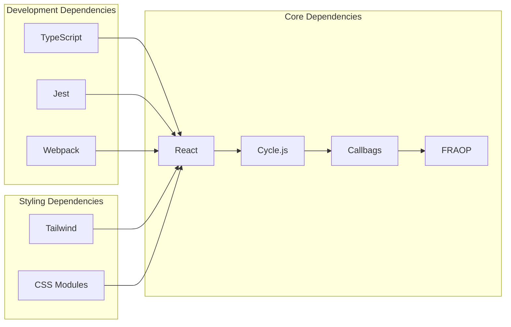
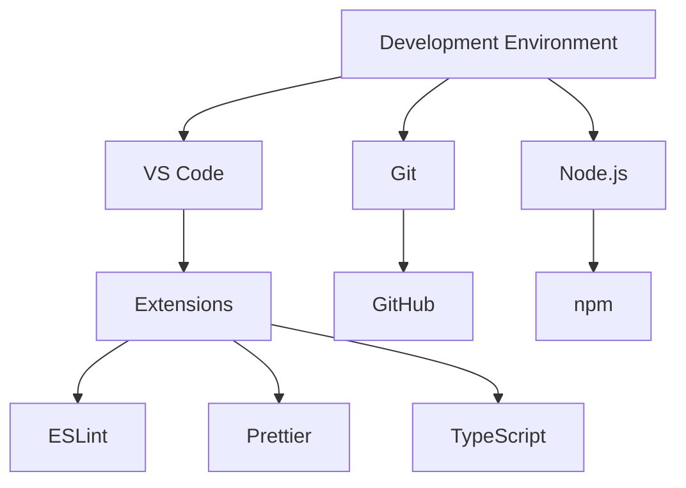
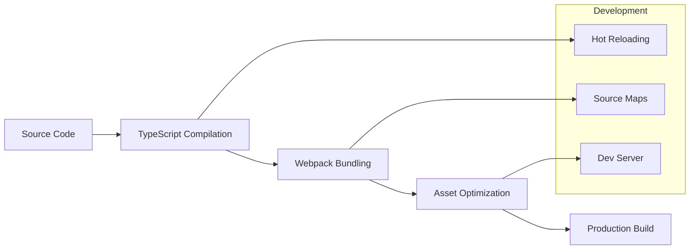
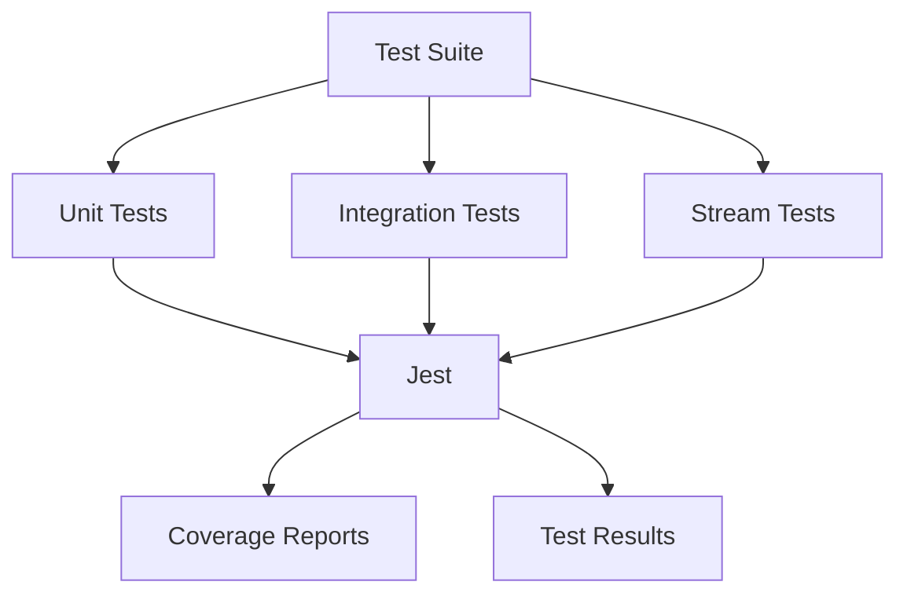
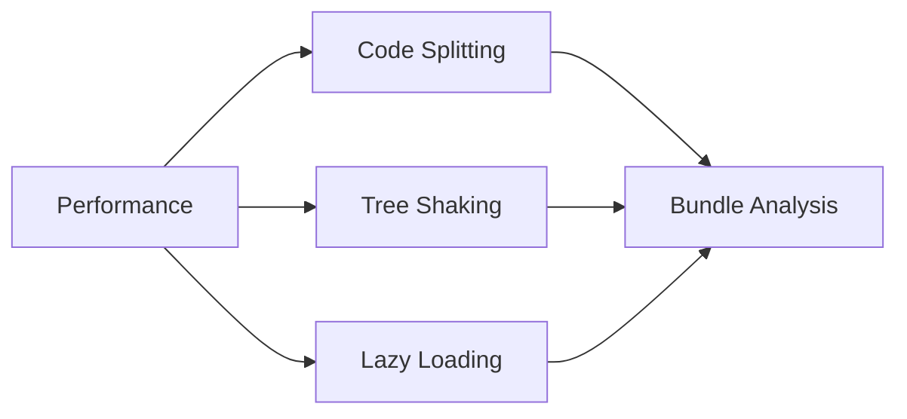
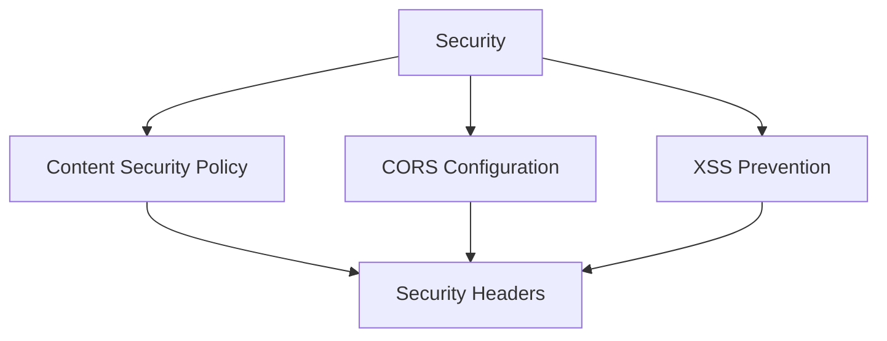

# SpinbitZ Technical Stack

## Overview
This document outlines the complete technical stack for the SpinbitZ website rebuild, focusing on the FRAOP architecture implementation and modern web development practices.

## Architecture Stack

## Technology Matrix

## Component Dependencies

## Version Requirements

| Technology | Version | Purpose |
|------------|---------|----------|
| Node.js | >= 16.0.0 | Runtime Environment |
| React | ^18.0.0 | UI Framework |
| Cycle.js | ^1.0.0 | FRAOP Framework |
| Callbags | ^3.2.0 | Stream Management |
| TypeScript | ^5.0.0 | Type Safety |
| Jest | ^29.0.0 | Testing Framework |
| Webpack | ^5.0.0 | Build Tool |
| Tailwind CSS | ^3.0.0 | Styling Framework |

## Development Environment

## Build Process

## Testing Infrastructure

## Performance Optimization

## Security Measures

## Implementation Guidelines

1. **Code Organization**
   - Follow FRAOP architecture patterns
   - Implement proper stream management
   - Use TypeScript for type safety

2. **Development Workflow**
   - Follow TTDD methodology
   - Implement proper testing
   - Use Git flow for version control

3. **Performance Considerations**
   - Implement proper code splitting
   - Use efficient stream operations
   - Optimize bundle size

4. **Security Practices**
   - Implement proper CSP
   - Use secure dependencies
   - Follow security best practices

## Monitoring and Analytics

1. **Performance Monitoring**
   - Track Core Web Vitals
   - Monitor stream performance
   - Track bundle size

2. **Error Tracking**
   - Implement error boundaries
   - Track stream errors
   - Monitor runtime errors

3. **Analytics**
   - Track user interactions
   - Monitor performance metrics
   - Track error rates

## Deployment Strategy

1. **Build Process**
   - Optimize production build
   - Implement proper caching
   - Use CDN for assets

2. **Deployment Pipeline**
   - Implement CI/CD
   - Use automated testing
   - Implement proper rollback

3. **Monitoring**
   - Track deployment metrics
   - Monitor performance
   - Track error rates 