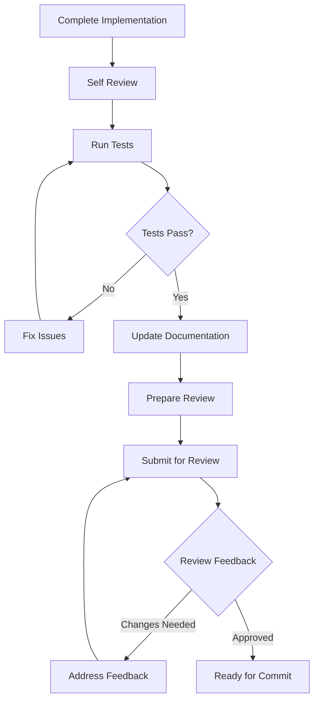

# Code Review Process

## Overview
This document outlines the code review process for the SpinbitZ project, ensuring code quality, consistency, and knowledge sharing across the team.

## Review Workflow



## 1. Pre-Review Checklist

### Code Quality
- [ ] Code follows project standards
- [ ] No linting errors
- [ ] No TypeScript errors
- [ ] Proper error handling
- [ ] No console.log statements
- [ ] No commented-out code

### Testing
- [ ] All tests pass
- [ ] Test coverage meets requirements
- [ ] Edge cases are covered
- [ ] Tests are well-documented
- [ ] No flaky tests

### Documentation
- [ ] Code is well-documented
- [ ] Complex logic is explained
- [ ] API changes are documented
- [ ] README is updated if needed
- [ ] Documentation is clear and concise

## 2. Review Submission

### Pull Request Format
```markdown
## Description
Brief description of changes

## Related Tasks
- TASK-XXX: Task name
- TASK-YYY: Related task

## Changes Made
- Change 1
- Change 2

## Testing
- [ ] Unit tests added/updated
- [ ] Integration tests added/updated
- [ ] All tests pass
- [ ] Test coverage maintained

## Documentation
- [ ] Code documented
- [ ] README updated
- [ ] API docs updated
```

## 3. Review Process

### Reviewer Responsibilities
1. Code Quality
   - Check for best practices
   - Verify error handling
   - Review performance implications
   - Check for security issues

2. Testing
   - Verify test coverage
   - Check test quality
   - Ensure edge cases covered
   - Review test documentation

3. Documentation
   - Check code comments
   - Review API documentation
   - Verify README updates
   - Check for missing documentation

### Feedback Guidelines
- Be specific and constructive
- Provide examples when possible
- Explain the reasoning
- Suggest improvements
- Use a respectful tone

## 4. Post-Review

### Addressing Feedback
1. Review all comments
2. Prioritize changes
3. Make necessary updates
4. Re-run tests
5. Update documentation
6. Request re-review if needed

### Final Checklist
- [ ] All feedback addressed
- [ ] Tests still pass
- [ ] Documentation updated
- [ ] No new issues introduced
- [ ] Ready for commit (waiting for explicit request)

## Best Practices

### For Authors
- Keep changes focused
- Write clear commit messages
- Respond to feedback promptly
- Update documentation as needed
- Test thoroughly before submission

### For Reviewers
- Review promptly
- Be thorough but efficient
- Provide constructive feedback
- Check for common issues
- Verify documentation

## Common Issues

### Code Quality
- Inconsistent formatting
- Poor error handling
- Missing type definitions
- Unnecessary complexity
- Performance issues

### Testing
- Insufficient test coverage
- Missing edge cases
- Flaky tests
- Poor test organization
- Missing test documentation

### Documentation
- Missing code comments
- Outdated documentation
- Unclear explanations
- Missing API docs
- Incomplete README updates 