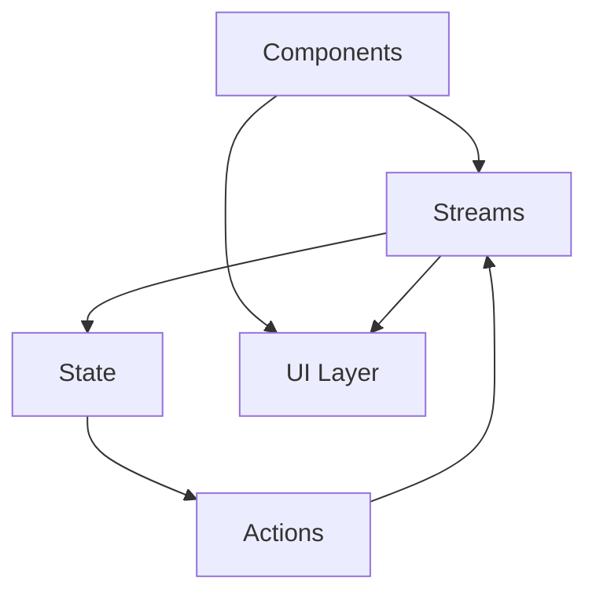

# Development Guidelines

## Overview
This document outlines the development guidelines for the SpinbitZ project, ensuring consistent code quality, maintainability, and best practices across the codebase.

## 1. Code Structure

### FRAOP Architecture


### Directory Structure
```
src/
├── components/     # React components
├── streams/        # Reactive streams
├── state/         # State management
├── actions/       # Action creators
├── utils/         # Utility functions
├── types/         # TypeScript types
├── constants/     # Constants and config
└── test/          # Test files
```

## 2. Coding Standards

### TypeScript
- Use strict mode
- Define explicit types
- Use interfaces for objects
- Leverage type inference
- Document complex types

### React Components
```typescript
// Component structure
import React from 'react';
import { useStream } from '../streams';
import { ComponentProps } from '../types';

export const Component: React.FC<ComponentProps> = ({ prop1, prop2 }) => {
  // Hooks
  const stream = useStream();
  
  // Handlers
  const handleEvent = () => {
    // Implementation
  };
  
  // Render
  return (
    <div>
      {/* JSX */}
    </div>
  );
};
```

### Naming Conventions
- Components: PascalCase
- Functions: camelCase
- Types/Interfaces: PascalCase
- Constants: UPPER_SNAKE_CASE
- Files: kebab-case

## 3. State Management

### Stream Structure
```typescript
// Stream definition
import { createStream } from '../utils/stream';

export const dataStream = createStream({
  initialState: {
    data: null,
    loading: false,
    error: null
  },
  actions: {
    fetchData: async () => {
      // Implementation
    }
  }
});
```

### State Updates
- Use immutable updates
- Handle loading states
- Manage error states
- Implement optimistic updates
- Document state changes

## 4. Testing Guidelines

### Component Tests
```typescript
import { render, screen } from '../test/utils';
import { Component } from './Component';

describe('Component', () => {
  it('renders correctly', () => {
    render(<Component />);
    expect(screen.getByText('Expected Text')).toBeInTheDocument();
  });
});
```

### Test Organization
- Group related tests
- Use descriptive names
- Follow AAA pattern
- Mock external dependencies
- Test edge cases

## 5. Documentation

### Code Comments
```typescript
/**
 * Component description
 * @param {string} prop1 - Description of prop1
 * @param {number} prop2 - Description of prop2
 * @returns {JSX.Element} Rendered component
 */
```

### README Structure
```markdown
# Component/Feature Name

## Overview
Brief description

## Usage
```typescript
import { Component } from './Component';

<Component prop1="value" prop2={42} />
```

## Props
| Name  | Type   | Required | Description |
|-------|--------|----------|-------------|
| prop1 | string | Yes      | Description |
| prop2 | number | No       | Description |

## Examples
Code examples

## Notes
Additional information
```

## 6. Performance

### Optimization Guidelines
- Use React.memo for pure components
- Implement proper key props
- Lazy load components
- Optimize re-renders
- Monitor bundle size

### Best Practices
- Keep components small
- Use proper hooks
- Implement error boundaries
- Handle loading states
- Optimize images

## 7. Error Handling

### Error Boundaries
```typescript
class ErrorBoundary extends React.Component {
  state = { hasError: false };

  static getDerivedStateFromError(error) {
    return { hasError: true };
  }

  render() {
    if (this.state.hasError) {
      return <ErrorComponent />;
    }
    return this.props.children;
  }
}
```

### Error Management
- Use try-catch blocks
- Implement fallbacks
- Log errors properly
- Handle async errors
- Provide user feedback

## 8. Git Workflow

### Branch Naming
- feature/feature-name
- bugfix/bug-description
- hotfix/issue-description
- release/version-number

### Commit Messages
```
type(scope): description

- Detailed change 1
- Detailed change 2

TASK-XXX
```

## 9. Security

### Best Practices
- Sanitize user input
- Implement CSRF protection
- Use secure headers
- Handle sensitive data
- Follow OWASP guidelines

### Authentication
- Use secure tokens
- Implement proper auth flow
- Handle session management
- Secure API endpoints
- Monitor auth attempts

## 10. Accessibility

### Guidelines
- Use semantic HTML
- Implement ARIA labels
- Ensure keyboard navigation
- Maintain color contrast
- Test with screen readers

### Testing
- Run a11y audits
- Test keyboard navigation
- Verify screen reader compatibility
- Check color contrast
- Validate ARIA usage 