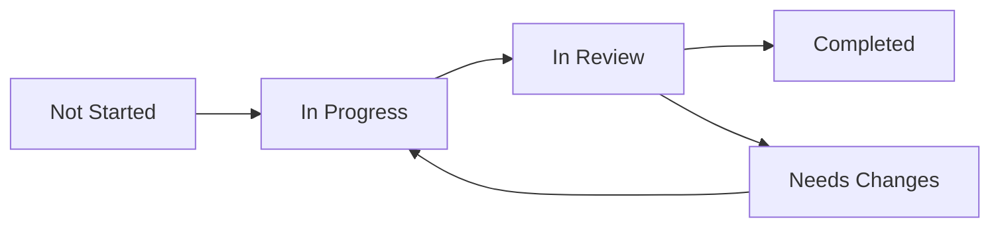

# Development Workflow

## Overview
This document outlines the development workflow for the SpinbitZ project, following Test and Task Driven Development (TTDD) principles.

## Table of Contents
1. [TTDD Process](#ttdd-process)
2. [Task Management](#task-management)
3. [Code Review Process](#code-review-process)
4. [Quality Assurance](#quality-assurance)
5. [Development Guidelines](#development-guidelines)

## TTDD Process

### 1. Task Creation
- Create task file using template
- Define acceptance criteria
- Set up test cases
- Document implementation notes

### 2. Test Implementation
- Write tests first
- Follow test structure:
  ```typescript
  describe('Component/Feature', () => {
    it('should behave in expected way', () => {
      // Arrange
      // Act
      // Assert
    });
  });
  ```

### 3. Implementation
- Implement feature to pass tests
- Follow project structure
- Maintain code quality
- Document changes

### 4. Review
- Self-review against checklist
- Submit for team review
- Address feedback
- Update documentation

## Task Management

### Task States


### Task Dependencies
- Track dependencies in task files
- Update dependent tasks when needed
- Maintain dependency graph

## Code Review Process

### 1. Pre-Review
- Self-review against checklist
- Run tests locally
- Update documentation
- Prepare commit message

### 2. Review Submission
- Create pull request
- Link related tasks
- Add reviewers
- Provide context

### 3. Review Process
- Review against criteria
- Check test coverage
- Verify documentation
- Provide feedback

### 4. Post-Review
- Address feedback
- Update as needed
- Re-run tests
- Final review

## Quality Assurance

### 1. Code Quality
- Follow style guide
- Maintain test coverage
- Document changes
- Review dependencies

### 2. Testing
- Unit tests
- Integration tests
- End-to-end tests
- Performance tests

### 3. Documentation
- Update relevant docs
- Add examples
- Include diagrams
- Review accuracy

## Development Guidelines

### 1. Code Structure
- Follow FRAOP architecture
- Maintain component hierarchy
- Use proper file organization
- Follow naming conventions

### 2. Testing
- Write tests first
- Use test utilities
- Follow test patterns
- Maintain coverage

### 3. Documentation
- Keep docs up to date
- Use clear language
- Include examples
- Add diagrams

### 4. Git Workflow
- Use feature branches
- Write clear commits
- Link tasks
- Keep history clean 