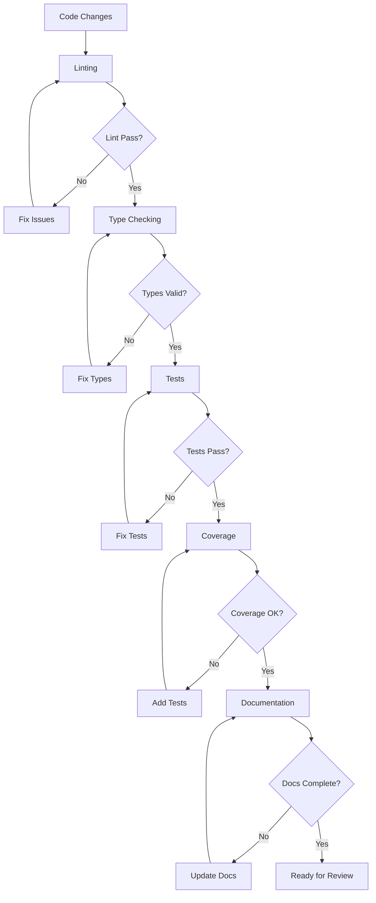

# Quality Assurance Process

## Overview
This document outlines the quality assurance process for the SpinbitZ project, ensuring high-quality code, comprehensive testing, and thorough documentation.

## Quality Gates

## 1. Code Quality

### Linting
- ESLint configuration
- Style guide compliance
- Best practices enforcement
- Error prevention
- Code consistency

### Type Safety
- TypeScript strict mode
- Type definitions
- Interface compliance
- Generic type usage
- Type inference

### Code Structure
- FRAOP architecture
- Component organization
- File structure
- Naming conventions
- Code reusability

## 2. Testing Requirements

### Coverage Requirements
- Minimum 90% coverage
- Critical paths 100%
- Edge cases covered
- Error scenarios tested
- Performance tested

### Test Types
1. Unit Tests
   - Component tests
   - Function tests
   - Utility tests
   - State management tests

2. Integration Tests
   - Component interaction
   - API integration
   - State flow
   - Error handling

3. End-to-End Tests
   - User flows
   - Critical paths
   - Error scenarios
   - Performance

## 3. Documentation Standards

### Code Documentation
- JSDoc comments
- Type definitions
- Function documentation
- Component documentation
- API documentation

### Project Documentation
- README files
- Architecture docs
- Setup guides
- API references
- Usage examples

### Process Documentation
- Workflow docs
- Review process
- Testing approach
- Quality standards
- Best practices

## 4. Review Process

### Pre-Review Checks
- [ ] Linting passes
- [ ] Types valid
- [ ] Tests pass
- [ ] Coverage met
- [ ] Docs updated

### Review Focus
1. Code Quality
   - Architecture compliance
   - Error handling
   - Performance
   - Security
   - Maintainability

2. Testing
   - Coverage
   - Test quality
   - Edge cases
   - Error scenarios
   - Performance tests

3. Documentation
   - Completeness
   - Accuracy
   - Clarity
   - Examples
   - Updates

## 5. Continuous Integration

### Automated Checks
- Linting
- Type checking
- Unit tests
- Integration tests
- Coverage reports

### Build Process
- Clean builds
- Dependency checks
- Asset optimization
- Environment setup
- Deployment prep

## Best Practices

### Code Quality
- Follow style guide
- Use TypeScript features
- Handle errors properly
- Write clean code
- Document complex logic

### Testing
- Write tests first
- Cover edge cases
- Test error scenarios
- Maintain coverage
- Keep tests focused

### Documentation
- Keep docs updated
- Use clear language
- Include examples
- Add diagrams
- Review regularly

## Common Issues

### Code Quality
- Inconsistent style
- Type errors
- Poor error handling
- Complex logic
- Performance issues

### Testing
- Low coverage
- Missing tests
- Flaky tests
- Poor organization
- Incomplete testing

### Documentation
- Outdated docs
- Missing information
- Unclear explanations
- No examples
- Poor structure 