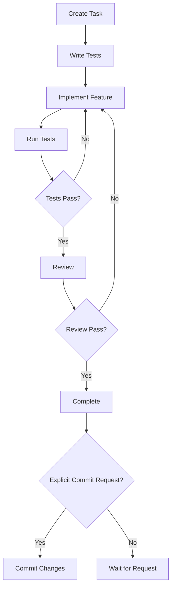

# Test and Task Driven Development (TTDD) Process

## Overview
This document details the Test and Task Driven Development (TTDD) process used in the SpinbitZ project. TTDD combines the principles of Test-Driven Development (TDD) with structured task management to ensure high-quality, well-tested code.

## Process Flow



## 1. Task Creation

### Task Structure
- Use task template
- Define clear objectives
- List acceptance criteria
- Document test cases
- Note dependencies

### Example Task
```markdown
# TASK-XXX: Feature Name

## Status
- [ ] Not Started
- [ ] In Progress
- [ ] In Review
- [ ] Completed

## Acceptance Criteria
- [ ] Criterion 1
- [ ] Criterion 2

## Test Cases
1. Test case 1
2. Test case 2
```

## 2. Test Implementation

### Test Structure
```typescript
describe('Feature/Component', () => {
  // Setup
  beforeEach(() => {
    // Arrange
  });

  // Test cases
  it('should behave in expected way', () => {
    // Arrange
    const input = 'test';
    
    // Act
    const result = process(input);
    
    // Assert
    expect(result).toBe('expected');
  });
});
```

### Test Categories
1. Unit Tests
   - Test individual components
   - Mock dependencies
   - Focus on behavior

2. Integration Tests
   - Test component interactions
   - Use test utilities
   - Verify workflows

3. End-to-End Tests
   - Test complete features
   - Use real data
   - Verify user flows

## 3. Implementation

### Code Structure
- Follow FRAOP architecture
- Use proper file organization
- Maintain naming conventions
- Document complex logic

### Quality Checks
- Run linter
- Check test coverage
- Verify documentation
- Review dependencies

## 4. Review Process

### Self-Review
- Run all tests
- Check acceptance criteria
- Update documentation
- Prepare commit message

### Team Review
- Submit pull request
- Link related tasks
- Add reviewers
- Address feedback

### Commit Process
- **CRITICAL RULE**: Commits are ONLY made after:
  1. Task is fully completed
  2. All tests pass
  3. Code review is approved
  4. Documentation is updated
  5. Explicit commit request is received
- Never commit files without explicit request
- Each commit must be tied to a specific task
- Commit messages must follow the project format

## Best Practices

### 1. Testing
- Write tests first
- Use descriptive names
- Follow AAA pattern
- Maintain coverage

### 2. Implementation
- Keep code simple
- Follow patterns
- Document changes
- Review regularly

### 3. Documentation
- Keep docs updated
- Add examples
- Include diagrams
- Review accuracy

## Tools and Resources

### Testing
- Vitest for unit tests
- Testing Library for components
- Mock data generators
- Test utilities

### Documentation
- Markdown for docs
- Mermaid for diagrams
- TypeDoc for API docs
- Storybook for components

## Common Pitfalls

### 1. Testing
- Writing tests after implementation
- Incomplete test coverage
- Unclear test names
- Missing edge cases

### 2. Implementation
- Over-complicated solutions
- Missing documentation
- Inconsistent patterns
- Poor error handling

### 3. Documentation
- Outdated docs
- Missing examples
- Unclear instructions
- Incomplete diagrams 